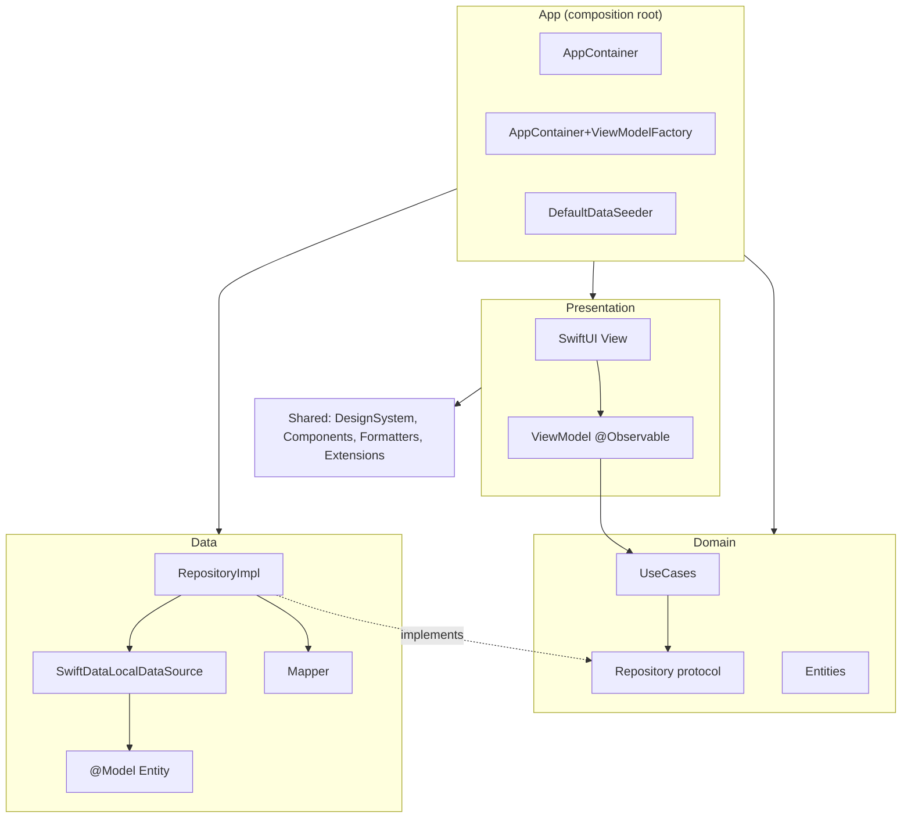

# Kiến trúc — Sổ Thu Chi (ExpenseTracker)

Tài liệu mô tả kiến trúc **đang được hiện thực** trong source. Kế hoạch ban đầu nằm ở [expense_tracker_clean_architecture_plan.md](expense_tracker_clean_architecture_plan.md); nếu hai tài liệu khác nhau thì tài liệu này và code là nguồn đúng.

Checklist khi code: [CODING_CHECKLIST.md](CODING_CHECKLIST.md).

---

## 1. Tổng quan

| Thành phần | Lựa chọn |
|---|---|
| Nền tảng | iOS 17+, iPhone |
| UI | SwiftUI, Swift Charts, một phần UIKit (`UITextField` nhập tiền) |
| Kiến trúc | Clean Architecture, MVVM ở Presentation |
| State | Observation (`@Observable`) |
| Lưu trữ | SwiftData, chỉ trên thiết bị |
| Concurrency | `async/await`, toàn bộ pipeline chạy trên `@MainActor` |
| DI | Constructor injection, composition root là `AppContainer` |
| Test | XCTest (`ExpenseTrackerTests`) |
| Ngôn ngữ build | `SWIFT_VERSION = 5.0` |

App không có backend, không đăng nhập, không đồng bộ đám mây.

---

## 2. Các tầng và quy tắc phụ thuộc



Hướng phụ thuộc: **`Presentation → Domain ← Data`**, `App` biết tất cả để nối dây.

| Tầng | Được import | Không được import / không được làm |
|---|---|---|
| Domain | `Foundation` | `SwiftUI`, `SwiftData`, `UIKit`; không biết tới Data, Presentation, Shared |
| Data | `Foundation`, `SwiftData`, Domain | Không trả `@Model` ra ngoài repository |
| Presentation | `SwiftUI`, `Observation`, `Charts`, Domain, Shared | Không `import SwiftData`, không gọi repository/data source trực tiếp |
| Shared | `SwiftUI`, `UIKit`, `Foundation`, Domain entity (để hiển thị) | Không chứa nghiệp vụ |
| App | Tất cả | Là nơi **duy nhất** khởi tạo implementation cụ thể |

Tất cả target nằm chung một module Xcode, nên các quy tắc trên được giữ bằng review và bằng checklist, không phải bằng compiler.

---

## 3. Cấu trúc thư mục

```text
ExpenseTracker/
├── App/
│   ├── ExpenseTrackerApp.swift            # @main, tạo AppContainer
│   ├── AppContainer.swift                 # ModelContainer → DataSource → Repository → UseCases
│   ├── RootView.swift                     # Màn chờ bootstrap + TabView
│   ├── Bootstrap/DefaultDataSeeder.swift  # Seed danh mục và tài khoản mặc định
│   └── Factories/AppContainer+ViewModelFactory.swift
├── Domain/
│   ├── Entities/                          # Struct thuần Swift, Sendable, Equatable
│   │   └── Statistics/                    # Model kết quả thống kê (read model)
│   ├── Errors/DomainError.swift
│   ├── Repositories/                      # Protocol
│   └── UseCases/                          # Mỗi aggregate một struct use case
├── Data/
│   ├── Local/Models/                      # @Model SwiftData
│   ├── Local/DataSources/                 # SwiftDataLocalDataSource<Entity> + extension theo entity
│   ├── Mappers/                           # Entity ↔ Domain
│   └── Repositories/                      # RepositoryImpl + PersistenceErrorMapper
├── Presentation/
│   ├── Dashboard/  Transactions/  Statistics/  Accounts/  Budgets/  Categories/  Settings/
│   │   ├── <Feature>View.swift
│   │   ├── <Feature>ViewModel.swift
│   │   ├── Components/                    # View con chỉ dùng trong feature
│   │   └── Models/                        # Kiểu chỉ dành cho UI (sort, nhóm theo ngày…)
│   └── Shared/Extensions/                 # Mở rộng Domain cho hiển thị (title, color…)
└── Shared/
    ├── Components/                        # View dùng lại giữa các feature
    ├── DesignSystem/                      # Theme, spacing, typography, view modifier
    ├── Extensions/                        # Tiện ích chung, thông báo lỗi cho người dùng
    └── Formatters/                        # Tiền VND, ngày tháng
ExpenseTrackerTests/
├── DomainUseCaseTests.swift               # Use case với mock repository
└── PersistenceTests.swift                 # SwiftData in-memory qua AppContainer
```

---

## 4. Domain

### 4.1 Entity

| Entity | Vai trò |
|---|---|
| `ExpenseTransaction` | Giao dịch: `amount > 0`, `type`, `date`, `note?`, `categoryID`, `accountID` |
| `ExpenseCategory` | Danh mục thu hoặc chi, có `icon` (SF Symbol) và `colorHex` |
| `Account` | Ví/tài khoản với `initialBalance` |
| `Budget` | Ngân sách theo danh mục chi và theo tháng |
| `TransactionType` | `income` / `expense` |
| `MonthlySummary`, `CategorySpending`, `DailySpending`, `DailyCashFlow`, `BudgetProgress` | Kết quả tính toán, không lưu trữ |

Entity là `struct` bất biến (`let`), `Identifiable`, `Equatable`, `Sendable`. Liên kết giữa các entity dùng ID (`UUID`), không dùng tham chiếu.

Helper trên tập giao dịch (`ExpenseTransaction.swift`): `totalAmount`, `ofType(_:)`, `inMonth(_:calendar:)`. Mọi phép lọc/cộng trong use case nên đi qua các helper này.

### 4.2 Use case

Mỗi aggregate có một `struct` use case gom các thao tác liên quan. Use case nhận repository qua thuộc tính `let` (memberwise init).

| Use case | API chính | Quy tắc nghiệp vụ |
|---|---|---|
| `TransactionUseCases` | `getAll`, `get(id:)`, `save(_:isEditing:)`, `delete(id:)` | Số tiền > 0; danh mục tồn tại và cùng `type`; tài khoản tồn tại |
| `CategoryUseCases` | `getAll`, `save`, `delete` | Tên không rỗng (được trim); không xoá danh mục đang có giao dịch |
| `AccountUseCases` | `getAll`, `save`, `delete`, `balances()`, `totalBalance()` | Tên không rỗng; số dư đầu ≥ 0; không xoá tài khoản đang có giao dịch; `balance = initial + income − expense` |
| `BudgetUseCases` | `getAll`, `save`, `delete`, `progress(for:)` | Số tiền > 0; danh mục tồn tại và là chi tiêu; mỗi danh mục tối đa một ngân sách/tháng; `ratio ≥ 0.8` → `warning`, `≥ 1` → `exceeded` |
| `StatisticsUseCases` | `monthlySummary`, `expenseByCategory`, `dailyExpense`, `dailyCashFlow`, `recent(limit:)` | Tổng hợp theo tháng/ngày/danh mục |

Phần tính toán thuần được tách thành `static func` (`AccountUseCases.calculateBalance`, `BudgetUseCases.status(for:)`, `StatisticsUseCases.summary/expenseByCategory/dailyCashFlow/dailyExpense`) để test không cần repository và để ViewModel dùng lại khi đã có dữ liệu trong tay.

Hàm có yếu tố thời gian nhận `calendar: Calendar = .current` để test được với lịch cố định.

### 4.3 Lỗi

`DomainError` là nguồn lỗi duy nhất đi ra khỏi Domain/Data:

```text
invalidAmount, invalidName, invalidTransactionType,
accountNotFound, categoryNotFound, transactionNotFound, budgetNotFound,
duplicateBudget, itemInUse, persistenceError
```

Domain chỉ định nghĩa **loại lỗi**. Chuỗi hiển thị tiếng Việt nằm ở `Shared/Extensions/Error+UserMessage.swift` (`DomainError.userMessage`, `Error.userMessage`).

### 4.4 Repository protocol

Bốn protocol CRUD (`TransactionRepository`, `CategoryRepository`, `AccountRepository`, `BudgetRepository`), đều `@MainActor` và `async throws`. Chữ ký `async` giúp có thể thay implementation (ví dụ background actor, API) mà không đổi Domain.

---

## 5. Data

### 5.1 SwiftData model

`TransactionEntity`, `CategoryEntity`, `AccountEntity`, `BudgetEntity` là `@Model final class` với `@Attribute(.unique) var id: UUID`. Enum được lưu dưới dạng `String` (`type`). `CategoryEntity.colorHex` là optional để tương thích dữ liệu cũ; khi `nil`, `ExpenseCategory` tự lấy màu từ `defaultPalette` hoặc màu mặc định theo loại.

### 5.2 Local data source

`SwiftDataLocalDataSource<Entity: PersistentModel>` bọc `ModelContext`:

```swift
fetchAll()                          // sắp xếp theo sort mặc định của entity
fetchFirst(where: Predicate<Entity>) // fetchLimit = 1
insert(_:)  saveChanges()  delete(_:)
```

Mỗi entity có một file khai báo `typealias` và extension ràng buộc cung cấp sort mặc định và `fetch(id:)` bằng `#Predicate`:

```swift
typealias AccountLocalDataSource = SwiftDataLocalDataSource<AccountEntity>

extension SwiftDataLocalDataSource where Entity == AccountEntity {
    convenience init(context: ModelContext) { … sortBy: [SortDescriptor(\.name)] }
    func fetch(id: UUID) throws -> AccountEntity? { … #Predicate { $0.id == id } }
}
```

### 5.3 Mapper

`enum XxxMapper` với ba hàm tĩnh: `toDomain(_:)` (có thể `throws` khi dữ liệu lưu không hợp lệ), `toEntity(_:)`, `update(_:from:)`. Mapper không có side effect ngoài việc gán thuộc tính.

### 5.4 Repository implementation

`XxxRepositoryImpl` ghép data source và mapper. Mọi thao tác được bọc trong `PersistenceErrorMapper.execute { … }`: `DomainError` giữ nguyên, lỗi khác (SwiftData) chuyển thành `.persistenceError`. Nhờ vậy tầng trên không bao giờ thấy lỗi của framework lưu trữ.

---

## 6. Presentation

### 6.1 MVVM

```text
View ──(action)──▶ ViewModel ──▶ UseCase
  ▲                    │
  └──(observe state)───┘
```

- **ViewModel**: `@MainActor @Observable final class`, nhận use case qua `init`, giữ UI state dạng thuộc tính `var`, expose hàm `async` (`load()`, `save(...) -> Bool`, `delete(_:)`, `moveMonth(_:)`). Lỗi được bắt và gán `errorMessage = error.userMessage`.
- **View**: giữ ViewModel bằng `@State` (sở hữu) hoặc `let`/`@Bindable` (được truyền vào). View chỉ render state, gọi hàm ViewModel trong `Task {}` / `.task {}` / `.refreshable {}`, và giữ state thuần UI (sheet đang mở, item đang sửa).
- **Form sheet**: state của form nằm trong View (`@State`) với form đơn giản (Account, Budget, Category) hoặc trong `TransactionFormViewModel` với form nhiều logic. Toolbar Huỷ/Lưu dùng chung `formToolbar(isSaveDisabled:onSave:)`; View tự `dismiss()` khi `save` trả về `true`.

### 6.2 Tạo ViewModel

`AppContainer+ViewModelFactory.swift` có một hàm `makeXxxViewModel()` cho mỗi ViewModel. View gốc của tab nhận `AppContainer` hoặc ViewModel đã tạo sẵn; view con không tự khởi tạo use case.

### 6.3 Điều hướng

`RootView` hiển thị màn chờ cho tới khi `container.bootstrap()` xong, sau đó `TabView` gồm 4 tab: Tổng quan, Giao dịch, Thống kê, Cài đặt. Mỗi tab có `NavigationStack` riêng. Tài khoản, Danh mục, Ngân sách được mở từ Cài đặt bằng `NavigationLink`. Thêm/sửa dùng `.sheet`; màn danh sách tải lại trong `onDismiss`.

### 6.4 Trạng thái màn hình

| Trạng thái | Cách hiển thị |
|---|---|
| Loading | `ProgressView` khi chưa có dữ liệu (`TransactionListViewModel.isLoading`) |
| Empty | `EmptyStateView` / `DashboardCompactEmptyState` |
| Error | `ErrorBanner` trong nội dung (Dashboard, Thống kê, Form) hoặc `.errorAlert(message:)` (danh sách CRUD) |

### 6.5 Mở rộng Domain cho hiển thị

Thuộc tính chỉ phục vụ UI được khai báo bằng extension ở Presentation/Shared, không đặt trong Domain:

- `TransactionType.title`, `TransactionType.color`
- `BudgetStatus.color`, `BudgetProgress.percentage`, `BudgetProgress.progressValue`
- `ExpenseCategory.color` (từ `colorHex`)

---

## 7. Shared

| Thư mục | Nội dung |
|---|---|
| `DesignSystem/` | `AppTheme` (màu), `AppSpacing`, `AppRadius`, `AppTypography`, modifier `appCard`, `appScreenBackground`, `appFormStyle`, `errorAlert`, `formToolbar`; `Color(hex:)`, `Color.hexRGB` |
| `Components/` | `AppIconBadge`, `AppMetricCard`, `AppSectionHeader`, `EmptyStateView`, `ErrorBanner`, `MonthSelector`, `TransactionRow`, `AmountTextField`, `VietnameseMoneyTextField` |
| `Formatters/` | `AppFormatters`: `money`, `compactMoney`, `decimal(from:)`, `vietnameseMoneyInput`, `monthYear`, `shortDate` (locale `vi_VN`, VND không có phần thập phân) |
| `Extensions/` | `Decimal.doubleValue`, `Date.addingMonths`, `Sequence.keyedByID()`, `userMessage` |

---

## 8. Luồng dữ liệu

### Ghi (thêm giao dịch)

```text
TransactionFormView ─ Lưu
  → TransactionFormViewModel.save()          # parse tiền, trim ghi chú, dựng ExpenseTransaction
  → TransactionUseCases.save(_, isEditing:)  # validate nghiệp vụ
  → TransactionRepository.addTransaction     # protocol
  → TransactionRepositoryImpl                # TransactionMapper.toEntity + PersistenceErrorMapper
  → TransactionLocalDataSource.insert        # context.insert + save
  → SwiftData
```

### Đọc (Dashboard)

```text
DashboardView.task → DashboardViewModel.load()
  → AccountUseCases.totalBalance / StatisticsUseCases.* / BudgetUseCases.progress / CategoryUseCases.getAll
  → Repository.getXxx → DataSource.fetchAll → Mapper.toDomain
  → ViewModel gán state → View render lại
```

### Khởi động

```text
ExpenseTrackerApp.init → AppContainer()   # tạo ModelContainer, nối dependency
RootView.task → container.bootstrap()     # DefaultDataSeeder: 12 danh mục + tài khoản "Tiền mặt" nếu DB trống
             → isReady = true → TabView
```

---

## 9. Kiểm thử

| File | Phạm vi |
|---|---|
| `DomainUseCaseTests` | Hàm tính toán tĩnh, validate của use case với mock repository (`Mock*Repository` là `private` trong file), formatter |
| `PersistenceTests` | `AppContainer(inMemory: true)`: round-trip giao dịch, màu danh mục, seed idempotent |

Chạy:

```sh
xcodebuild -project ExpenseTracker.xcodeproj -scheme ExpenseTracker \
  -destination 'platform=iOS Simulator,name=iPhone 17 Pro' test
```

---

## 10. Thêm một feature mới

1. **Domain**: entity (nếu cần) → method trong repository protocol → use case và `DomainError` mới (nhớ thêm `userMessage`).
2. **Data**: `@Model` + đăng ký trong `Schema` của `AppContainer` → data source (`typealias` + extension) → mapper → repository impl.
3. **App**: khởi tạo repository/use case trong `AppContainer`, thêm `makeXxxViewModel()` vào factory.
4. **Presentation**: thư mục `Presentation/<Feature>/` gồm View, ViewModel, `Components/` nếu cần.
5. **Test**: unit test cho quy tắc nghiệp vụ mới; persistence test nếu có model mới.
6. **Project**: thêm file vào `ExpenseTracker.xcodeproj` (xem mục 11).

---

## 11. Đánh đổi đã biết và nợ kỹ thuật

| Chủ đề | Hiện trạng | Hướng xử lý khi cần |
|---|---|---|
| Truy vấn | Use case lấy **toàn bộ** giao dịch rồi lọc trong bộ nhớ. Dashboard gọi nhiều use case nên fetch giao dịch nhiều lần mỗi lần tải. | Ổn với dữ liệu cá nhân (vài nghìn bản ghi). Khi lớn hơn: thêm method repository có tham số khoảng thời gian (`getTransactions(in: DateInterval)`) và đẩy lọc xuống `#Predicate`. |
| Concurrency | Toàn bộ repository/data source chạy trên `@MainActor` với `mainContext`. | Chuyển data source sang `@ModelActor` khi thao tác nặng; protocol đã `async` nên Domain không đổi. |
| Ràng buộc tham chiếu | Liên kết bằng UUID, không có relationship SwiftData; kiểm tra "đang được dùng" nằm ở use case. | Giữ nguyên để Domain độc lập với SwiftData. |
| Chuỗi giao diện | Chuỗi tiếng Việt viết trực tiếp trong code. | Chuyển sang String Catalog nếu cần đa ngôn ngữ. |
| Bảng màu danh mục mặc định | `ExpenseCategory.defaultPalette` gắn theo tên tiếng Việt, dùng cho cả seed và dữ liệu cũ thiếu màu. | Chấp nhận được vì là dữ liệu mặc định của app. |
| View giữ `AppContainer` | `DashboardView`, `TransactionListView`, `SettingsView` nhận container để tạo ViewModel con. | Chấp nhận trong app nhỏ; có thể thay bằng closure factory nếu cần preview/test UI tách biệt. |
| Project file | `project.pbxproj` liệt kê từng file (không dùng synchronized folder). `scripts/generate_project.rb` tạo lại toàn bộ project (cần Ruby + gem `xcodeproj`). | Thêm file bằng Xcode hoặc chạy lại script. |
